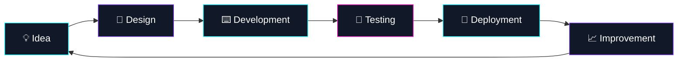

<div align="center">

  

  

  <br/>

  <a href="https://github.com/arnovia">
    
  </a>
  <a href="https://github.com/arnovia?tab=followers">
    
  </a>
  <a href="https://github.com/arnovia?tab=repositories">
    
  </a>

</div>

<br/>

<div align="center">
  
</div>

## `> whoami`

```ts
const arnovia = {
  role: "Software Developer",
  location: "Türkiye",
  focus: [
    "Full-Stack Development",
    "Modern Web Technologies",
    "Scalable Software Architecture",
    "Creative User Experiences",
    "Open Source"
  ],
  currentlyBuilding: "Useful products with clean, efficient and scalable code.",
  motto: "Turning ideas into reliable digital experiences."
};
```

<br/>

## Tech stack

<div align="center">

### Frontend


<br/><br/>

### Backend & databases


<br/><br/>

### Tools & DevOps


</div>

<br/>

## GitHub analytics

<div align="center">


<br/><br/>


</div>

<br/>

## Contribution activity

<div align="center">


</div>

<br/>

## Currently working on



- Modern, hızlı ve ölçeklenebilir web uygulamaları geliştiriyorum.
- Temiz kod, sürdürülebilir mimari ve güçlü kullanıcı deneyimine odaklanıyorum.
- Yeni teknolojileri keşfediyor, üretime dönüştürüyor ve açık kaynak projelere katkı sağlıyorum.
- Yeni iş birlikleri, freelance projeler ve yaratıcı fikirler için ulaşabilirsin.

<br/>

## Development mode

```text
💻 Frontend Development  █████████████████████░░░  88%
⚙️ Backend Development   ██████████████████░░░░░░  76%
🧠 Problem Solving       ██████████████████████░░  92%
🎨 UI / UX               █████████████████░░░░░░░  72%
🚀 DevOps & Deployment   ███████████████░░░░░░░░░  65%
```

<br/>

## Connect with me

<div align="center">

<a href="https://github.com/arnovia">
  
</a>

<a href="https://www.linkedin.com/in/USERNAME">
  
</a>

<a href="https://x.com/USERNAME">
  
</a>

<a href="mailto:mail@example.com">
  
</a>

<br/><br/>


</div>

<br/>

<div align="center">


</div>
